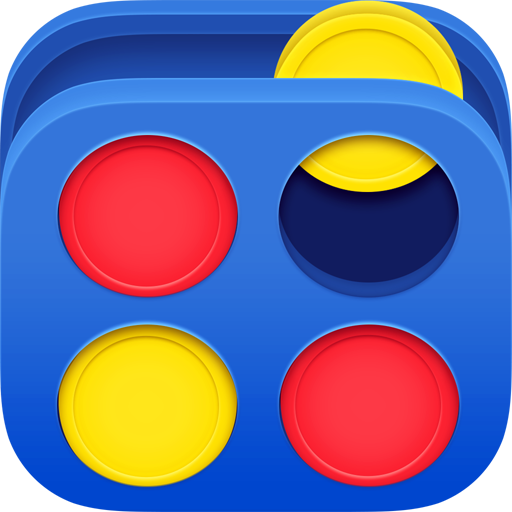
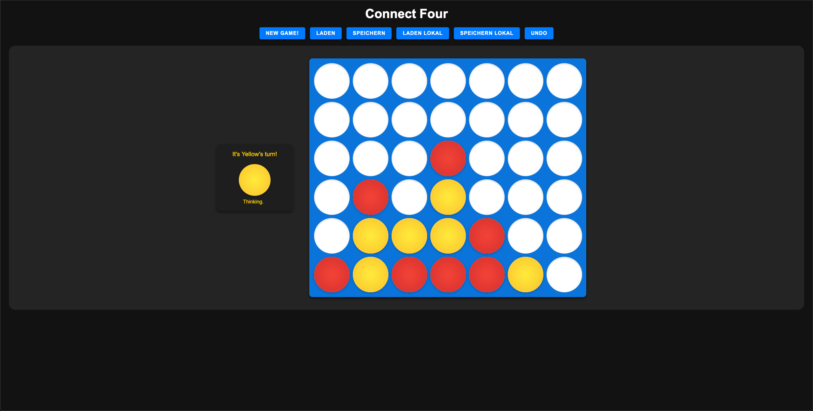

#  Connect Four - WBE Miniprojekt HS2024

## Teammitglieder
- Shpetim Veseli
- Christian köhler

## Beschreibung
Das Spiel Connect Four ist ein Spiel für zwei Spieler, bei dem die Spieler abwechselnd Spielsteine in ein vertikales Spielfeld fallen lassen. Der Spieler, der als erster vier Steine in einer Reihe, Spalte oder Diagonale hat, gewinnt das Spiel.

## Funktionsübersicht
- Neues Spiel starten und Spielbrett zurücksetzen
- Spielzug durchführen
- Spielstand überprüfen
- Gewinner ermitteln
- Spielzug rückgängig machen
- Anzeige welcher Spieler am Zug ist
- Anzeige des Gewinners
- Spielstand laden und speichern in LocalStorage
- Spielstand laden und speichern auf den Server

## Diverses
Der JavaScript Code wurde in ein model und view aufgeteilt. Das model beinhaltet die Spiellogik und das view die Darstellung des Spiels.

## Screenshots
